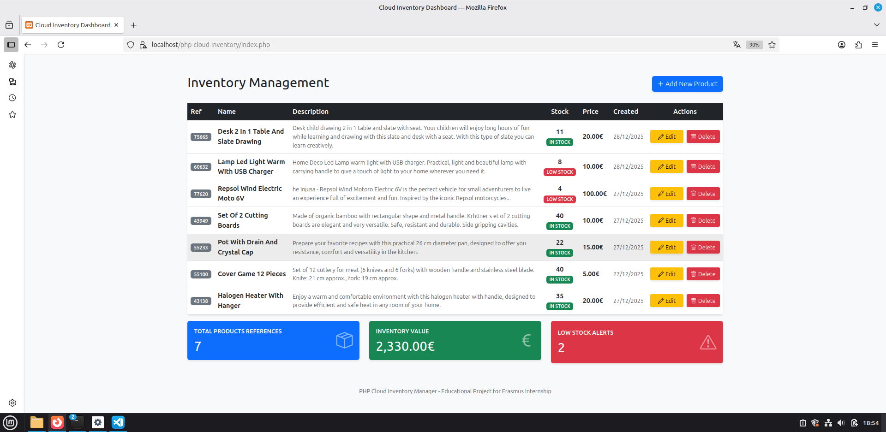

# 📦 PHP Cloud Inventory Manager

A professional, lightweight inventory management system developed as part of my **Web Application Development** training. This project demonstrates a full **CRUD** (Create, Read, Delete) cycle using secure coding practices and is designed with **Cloud Scalability** in mind.

## 🚀 Key Features
- **Secure CRUD Logic:** Implemented using PHP Data Objects (PDO) to prevent SQL Injection.
- **Relational Database:** Optimized MySQL schema including audit timestamps (`created_at`, `updated_at`).
- **Professional UI:** Responsive dashboard built with Bootstrap 5, featuring real-time user feedback (UX).
- **Git Flow:** Developed using a systematic feature-branching strategy to ensure code stability.

## 📸 Project Preview

### Main Dashboard


## 🎥 Video Demo
Watch the CRUD functionality and real-time statistics in action:
<div align="center">
  <video src="screenshots/inventory_management.movie" width="100%" controls></video>
</div>

## 🛠️ Tech Stack
- **Backend:** PHP 8.x (Object-Oriented Programming).
- **Database:** MySQL / MariaDB.
- **Frontend:** HTML5, Bootstrap 5, JavaScript (Confirmations).
- **Environment:** Linux (Mint) / Apache (LAMPP).

---

## 💻 Local Development & Environment Setup

This project is developed and hosted locally using **LAMPP** on **Linux Mint**. To ensure the application runs correctly, follow these steps:

1. **Start the XAMPP/LAMPP Manager:**
   Run the following commands in your terminal to launch the service manager:
   ```bash
   cd /opt/lampp
   sudo ./manager-linux-x64.run

2. **Activate Services:** 
   Inside the graphical manager, navigate to the "Manage Servers" tab and start:
   - MySQL Database: Handles all relational data storage.
   - Apache Web Server: Serves the PHP application files.

3. **Database Management:** You can access and verify the table structure through phpMyAdmin at `http://localhost/phpmyadmin`.

---

## ☁️ Technical Focus: Scaling to AWS
As a student with foundational **AWS Cloud** knowledge, I designed this application to be easily migratable to a production-ready cloud environment. Here is how I would scale this architecture:

### 1. Database Migration (High Availability)
- **Local to Managed:** Transition from a local MySQL server to **Amazon RDS (Relational Database Service)**.
- **Benefit:** This enables automated backups, multi-AZ deployment for disaster recovery, and easy scaling of storage and compute power.

### 2. Computing & High Availability
- **EC2 Instances:** Deploy the PHP application on **Amazon EC2** instances within a custom **VPC (Virtual Private Cloud)**.
- **Auto Scaling:** Implement an **Auto Scaling Group** to automatically launch or terminate instances based on CPU traffic.
- **Load Balancing:** Use an **Application Load Balancer (ALB)** to distribute incoming traffic across multiple instances, ensuring 24/7 availability.

### 3. Security & Networking
- **VPC Configuration:** Isolate the database in a private subnet while keeping the web server in a public subnet.
- **Security Groups:** Restrict access to the database so only the EC2 instances can communicate with it, minimizing the attack surface.

---

## 🔧 Setup & Installation
1. **Clone the repo:** `git clone https://github.com/ZomeED/php-cloud-inventory.git`.
2. **Database Setup:** Import the `/sql/schema.sql` file into your MySQL manager (phpMyAdmin).
3. **Configuration:** Set your database credentials in `config.php` (Note: This file is excluded via `.gitignore` for security).
4. **Deploy:** Move the folder to your `htdocs` or `/var/www/html/` directory and access it via `localhost`.

---
**Developer:** Jose Antonio Zomeño Pardo - Web Development Student  
**Contact:** joseantoniozome01@gmail.com
